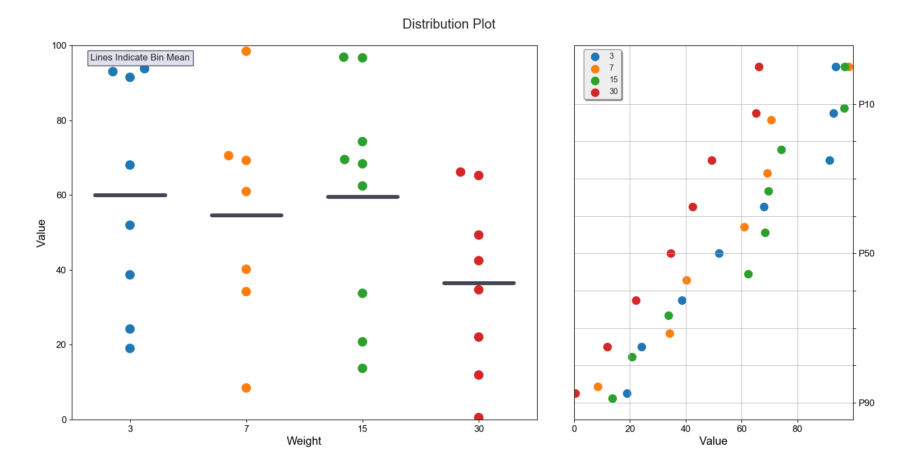
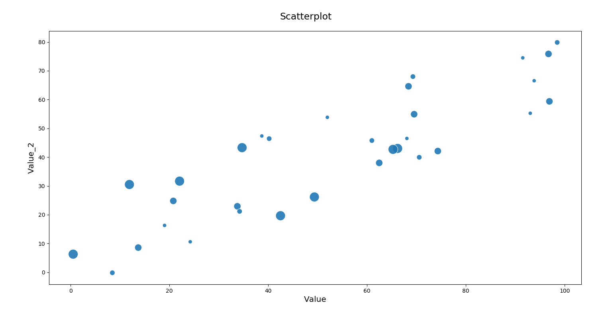
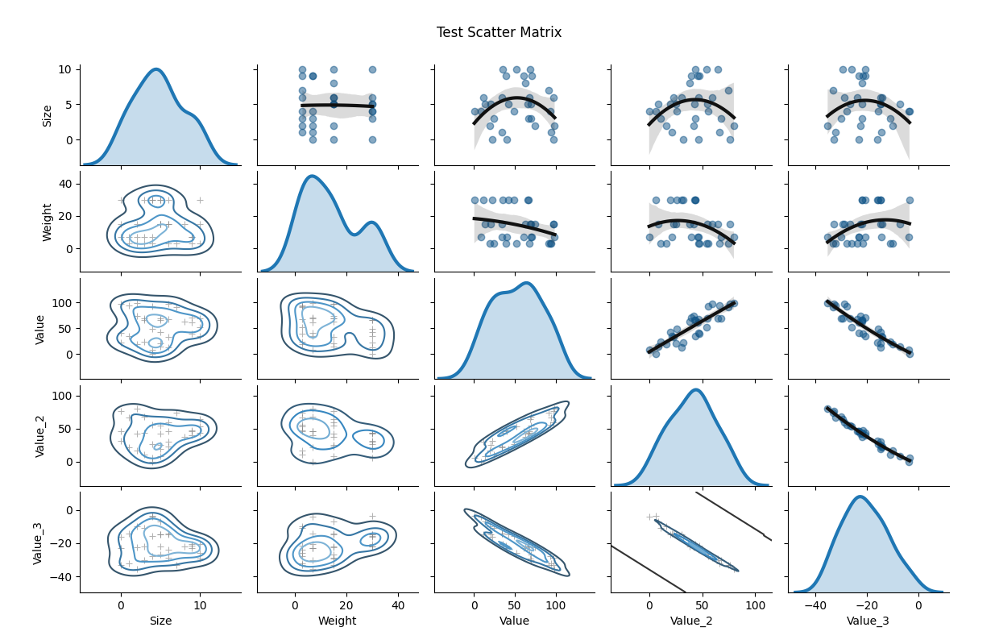

# Easy_Plot

Easy_plot is a Python package built to provide easy and fast production-quality visualizations of statistical data.
Utilizes pandas dataframes as standard format for input data.

# Current Features

  - easy_plot.distribution(df)
    - Plot a "Distribution Plot": a swarmplot alongside a cumulative probability plot.
    - Usage:
        ```sh
        import pandas
        import easy_plot
        df = pandas.read_csv('test.csv')
        easy_plot.distribution(df, bin_col='Weight', result_col='Value')
        ```
    

  - easy_plot.scatter(df)
    - Plot a scatter plot.
    - Usage:
        ```sh
        import pandas
        import easy_plot
        df = pandas.read_csv('test.csv')
        easy_plot.scatter(df, xvar='Value', yvar='Value_2', sizevar='Weight')
        ```
    

  - easy_plot.scatter_matrix(df)
    - Plot a matrix of scatter plots.
    - Usage:
        ```sh
        import pandas
        import easy_plot
        df = pandas.read_csv('test.csv')
        easy_plot.scatter_matrix(df)
        ```
    

  - easy_plot.heatmap(df)
    - Plot a heatmap.
    - Usage:
        ```sh
        import pandas
        import easy_plot
        df = pandas.read_csv('test.csv')
        easy_plot.heatmap(df)
        ```
    


License
----
MIT
