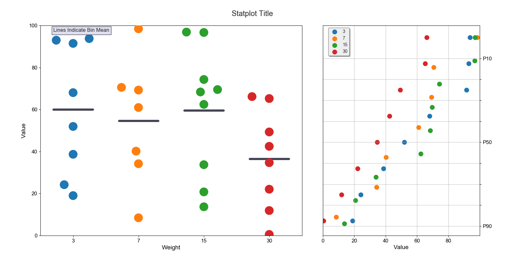
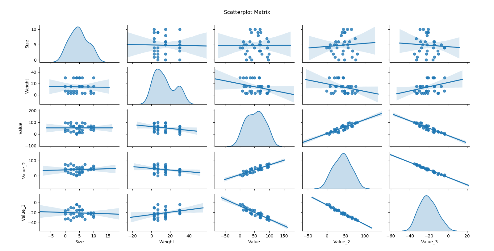
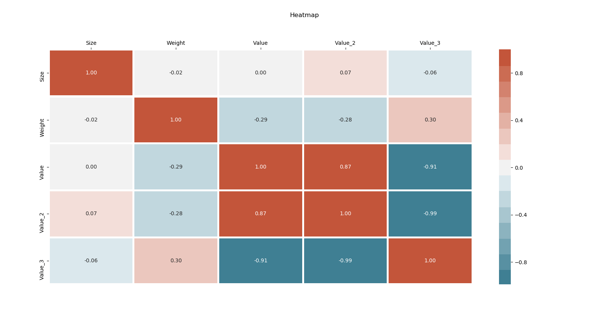

# statplot

statplot is a Python package built to provide easy and fast production-quality visualizations of statistical data.
Utilizes pandas dataframes as standard format for input data.

# Current Features

  - statplot.distribution_plot(df)
    - Plot a "Distribution Plot": a swarmplot alongside a cumulative probability plot.
    - Usage:
        ```sh
        import pandas
        import statplot
        df = pandas.read_csv('test.csv')
        statplot.distribution_plot(df)
        ```
    

  - statplot.scatterplot_matrix_plot(df)
    - Plot a matrix of scatterplots.
    - Usage:
        ```sh
        import pandas
        import statplot
        df = pandas.read_csv('test.csv')
        statplot.scatterplot_matrix_plot(df)
        ```
    

  - statplot.heatmap_plot(df)
    - Plot a heatmap.
    - Usage:
        ```sh
        import pandas
        import statplot
        df = pandas.read_csv('test.csv')
        statplot.heatmap_plot(df)
        ```
    


License
----
TODO
